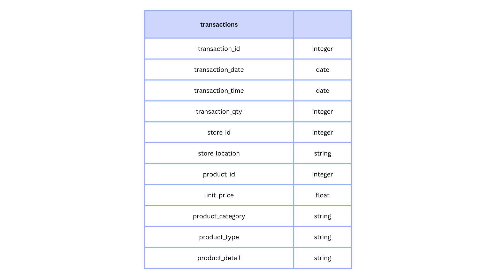

# **Project Background**

**York’s Coffee** is a specialty quick-service coffee franchise founded in New York City in 2021. Operating across three distinct neighborhoods — Hell’s Kitchen, Astoria, and Lower Manhattan. The company serves high-quality espresso drinks, brewed teas, fresh bakery items, and branded merchandise. It operates on a high-volume, quick-service retail business model relying on high daily foot traffic and strong customer retention during morning rush hours.  

As a Data Analyst within the operations and strategy team, I conducted a comprehensive analysis of six months of transactional data (January–June). The objective was to evaluate operational performance across store locations, understand customer purchasing habits, and identify core drivers of revenue to help management optimize revenue generation and operational efficiency.

Insights and recommendations are provided on the following key areas:

- **Sales Growth & Trajectory Trends** - Evaluating revenue growth patterns and monthly trajectory shifts across the six-month period.
- **Location & Basket Value Dynamics** - Benchmarking store revenue generation against Average Basket Value across all three locations.
- **Product Mix Performance & Revenue Drivers** - Analyzing category dominance and identifying unit volume vs. high-margin revenue drivers.
- **Peak Demand & Operational Staffing Patterns** - Mapping hourly traffic patterns to optimize staff scheduling and inventory preparation.

The Excel spreadsheet used to inspect and clean the data for this analysis can be found here [link](/data).

An interactive Tableau dashboard used to report and explore sales trends can be found here [link](https://public.tableau.com/app/profile/nmakmal/viz/CoffeeChainSalesAnalysis_17795973539350/SalesDashboard)

# **Data Structure & Initial Checks**

The transactional database structure as seen below consists of single table containing 9 key dimensions and metrics with a total row count of over **149k** records. 

# **Executive Summary**

## **Overview of Findings**

Between January and June, total monthly revenue demonstrated an aggressive **100% hockey-stick growth trajectory**, expanding from $76K in February to $166K in June.

While **Hell’s Kitchen** generated the largest share of overall sales **($237K)**, **Lower Manhattan** achieved the highest **Average Basket Value ($4.81)**. Sales performance is heavily concentrated, with **Coffee, Tea, and Bakery accounting for 79% of total revenue**, and customer demand peaking sharply between **7:00 AM and 10:00 AM** (representing 45% of daily volume).

# **Insights Deep Dive**

## **Sales Trajectory & Growth Trends**

- Monthly revenue expanded **100%** from **$76K in February** to **$166K in June**, sharply increasing store capacity utilization driven by seasonal foot traffic growth in New York City during spring/early summer and organic brand adoption across new locations.
- Sales acceleration was driven almost entirely by a **104%** surge in transaction volume while Average Order Value held flat near **$4.70**, indicating strong top-of-funnel customer acquisition that was underutilized due to a lack of POS cross-selling strategies.
- Sales grew at an average of **22%** MoM from March to June, which caused peak-hour inventory stockouts because operational ordering relied on static Q1 historical averages rather than predictive growth trajectories.

## **Store Location Performance**

- Hell’s Kitchen generated **$237K (34% of total revenue)** providing a stable core cash flow thanks to its prime location with high foot traffic capturing continuous commuter, tourist, and residence.
- Lower Manhattan generated the lowest total volume **(47.8K transactions)** but achieved the franchise’s highest **Average Basket Value at $4.81**, compared to Hell’s Kitchen ($4.66) and Astoria ($4.59). This indicates that its clientele yields a higher revenue-per-customer, likely driven by business district office workers ordering multi-item team orders or premium orders.
- Astoria logged high volume **(50.6K transactions)** but the lowest **Average Basket Value ($4.59)**, putting heavier wear on store equipment per dollar earned due to a high volume of single-item orders from local residential regulars.
- All three locations scaled revenue proportionally from January to June, demonstrating that brand equity scaled consistently citywide due to unified marketing and standardized menu rollouts.

## **Product Category & Menu Performance**

- Coffee, Tea, and Bakery accounted for **79% ($549K)** of total store revenue, leaving the business model highly dependent on morning beverages because customer brand perception remains narrowly framed around quick-service breakfast.
- **Barista Espresso** generated **13% of total revenue ($91.4K)** while ranking 3rd in total unit volume (24.9K units), serving as the most efficient margin driver on the menu because customers willingly pay premium price points ($3.75+) for handcrafted espresso drinks.
- The **bottom 10** menu items generated **less than 2%** of total revenue while adding unnecessary supply chain complexity and inventory carrying costs because legacy menu offerings were kept without routine performance audits.

## Operational Peak Demand

- The 7:00 AM–10:00 AM morning window generated 45% of daily transactions, making overall operational success entirely reliant on throughput speed during concentrated commuting hours.
- Transaction volumes drop significantly after 1:00 PM across all three store locations, driving up labor overhead costs relative to afternoon sales due to a lack of targeted afternoon product bundles.
- The **10:00 AM** hour processed over **18.6K** of total transactions, representing **2.1x** the unit volume of any other hour, leading to long customer wait times and abandoned walk-out sales caused by station preparation bottlenecks.
- Both weekday and weekend foot traffic follow an identical daily distribution of peaking sharply between 7:00 AM to10:00 AM before collapsing post 1:00 PM, which simplifies operational planning by standardizing shift scheduling and inventory prep across the week.

# **Recommendations:**

Based on the insights and findings above, we would recommend considering the following:

- **Optimize Morning Staffing & Pre-Prep:** Store Operations Team to reallocate afternoon shift hours to the 7 AM–10 AM morning rush window by pre-batch high-demand items to reduce wait times and prevent lost walk-out revenue.
- **Launch Afternoon Bundles Strategy:** Marketing & Promotions Team to introduce a "Midday Perk" food-and-beverage bundle past 1:00 PM to smooth out the post-lunch demand drop and increase store utilization.
- **Cross-Sell to Elevate Basket Values:** Sales Team to train staff in Astoria and Hell's Kitchen on add-on upsells to raise their Average Basket Values ($4.59 and $4.66) toward Lower Manhattan’s benchmark ($4.81).
- **Promote High-Margin Products:** Product & Merchandising Team to feature Barista Espresso prominently on menu boards, leveraging its superior margin efficiency over basic brewed beverages.
- **Align Inventory Scheduling:** Inventory team to adjust batch ordering schedules to align with the Feb-June sales surge by prioritizing high-turnover Coffee, Tea, and Bakery ingredients while establishing dynamic safety stock levels to prevent morning peak-hour stockouts and liquidating slow-moving inventory from the bottom 10 menu items.

# **Assumptions and Caveats:**

Throughout the analysis, multiple assumptions were made to manage challenges with the data. These assumptions and caveats are noted below:

- **Pricing Consistency:** Assumed `unit_price` remained static across the six-month period unless explicit promotional discounts were logged.
- **Exogenous Growth Factors:** The surge from March through June does not isolate macroeconomic variables, local foot traffic increases, or seasonal weather shifts.
- **Missing Line-Item Identifiers:** Multi-item purchases sharing the same `transaction_id` were aggregated at the basket level to derive `Average Basket Value`.
